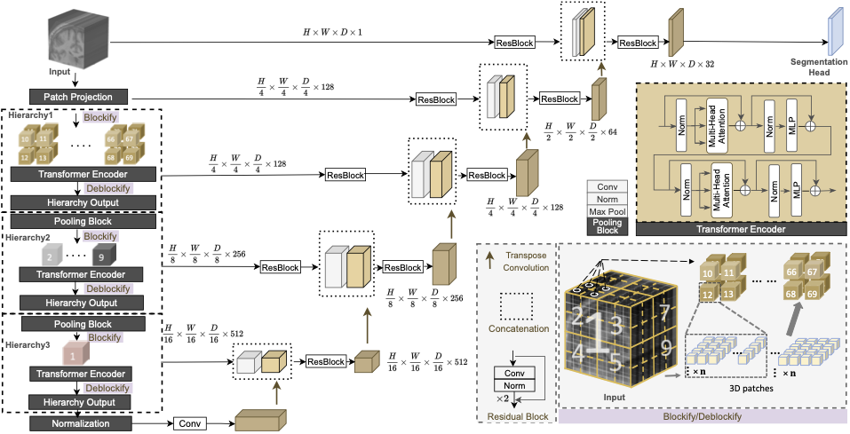

### [UNesT: Local Spatial Representation Learning with Hierarchical Transformer for Efficient Medical Segmentation](https://arxiv.org/abs/2209.14378)

The official Pytorch implementation UNesT.

[UNesT: Local Spatial Representation Learning with Hierarchical Transformer for Efficient Medical Segmentation](https://arxiv.org/abs/2209.14378). Medical Image Analysis, 2023 

[[`arXiv`](https://arxiv.org/abs/2209.14378)]

## Model Overview
---
<p align="center">

</p>

The proposed hierarchical transformer UNesT achieve SOTA performance on whole brain segmentation, multi-organ segmentation (BTCV) and kidney substructures segmentation.

 ## Installation
 ---
 Please refer to [INSTALL.md](INSTALL.md).

## Training and Inference
---
- Whole brain segmentation [README.md](wholebrainSeg/README.md)
- Renal Substructure segmentation [README.md](renalsubseg/README.md)
- Multi-organ Segmentation [README.md](multiorganSeg/README.md)

## MONAI Boundle
---
For developing publicly available segmentation tools, we introduce the MONAI Bundle module that supports building Python-based workflows via structured configurations. 
- Whole brain segmentation [MONAI Boundle](https://github.com/Project-MONAI/model-zoo/tree/dev/models/wholeBrainSeg_Large_UNEST_segmentation)
- Renal Substructure segmentation [MONAI Boundle](https://github.com/Project-MONAI/model-zoo/tree/dev/models/renalStructures_UNEST_segmentation)

## Results 
---
 ### Whole brain segmentation (5-fold ensembled)
 | Model |  #Params | FLOPs(G) | Colin DSC | CANDI DSC| 
|:---:|:---:|:---:|:---:| :---:|
| nnUNet |  30.7M | 358.6 | 0.7168 | 0.4337|
| TransBTS |  33.0M | 111.9 | 0.6537 | 0.6043|
| nnFormer |  158.9M | 920.1 | 0.7113 | 0.6393| 
| CoTr |  42.0M | 328.0 | 0.7209 | 0.6908|
| UNETR |  92.6M | 268.0 | 0.7320 | 0.6851|
| SwinUNETR |  62.2M | 334.9 | 0.6854 | 0.6537|
| SLANT27 |  19.9M × 27 | 2051.0 × 27 | 0.7264 | 0.6968|
| UNesT | 87.3M | 261.7G | 0.7444 | 0.7025|


### Renal Substructures segmentation (5-fold ensembled)
 | Model |  #Params | FLOPs(G) | Mean DSC| Mean HD|
|:---:|:---:|:---:|:---:|:---:|
| nnUNet |  30.7M | 358.6 | 0.7168 | 0.8075|22.3466|
| TransBTS |  33.0M | 111.9 | 0.6537 | 0.8073|21.7347|
| nnFormer |  158.9M | 920.1 | 0.7113 | 0.8205| 20.3219|
| CoTr |  42.0M | 328.0 | 0.7209 | 0.8123| 21.0707|
| UNETR |  92.6M | 268.0 | 0.7320 | 0.8308 |19.4696|
| SwinUNETR |  62.2M | 334.9 | 0.6854 | 0.8411|13.5398|
| UNesT | 87.3M | 261.7G | 0.7444 | 0.8564|10.1885|

## License
---
This project is released under the MIT license. Please see the [LICENSE](LICENSE) file for more information.

## Citation
---
If you find this repository useful, please consider citing the following papers:

```
@article{yu2023unest,
  title={UNesT: local spatial representation learning with hierarchical transformer for efficient medical segmentation},
  author={Yu, Xin and Yang, Qi and Zhou, Yinchi and Cai, Leon Y and Gao, Riqiang and Lee, Ho Hin and Li, Thomas and Bao, Shunxing and Xu, Zhoubing and Lasko, Thomas A and others},
  journal={Medical Image Analysis},
  pages={102939},
  year={2023},
  publisher={Elsevier}

}

```