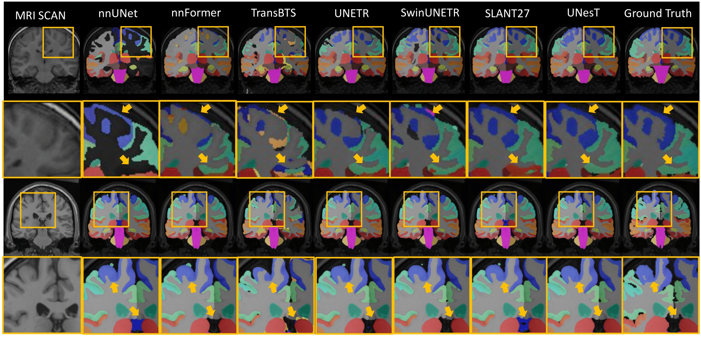
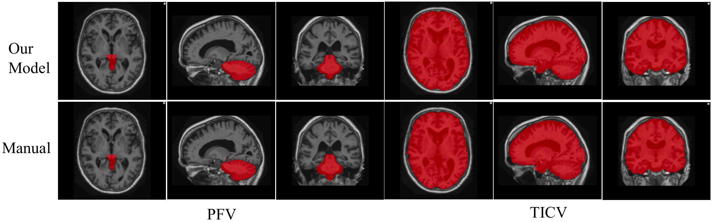
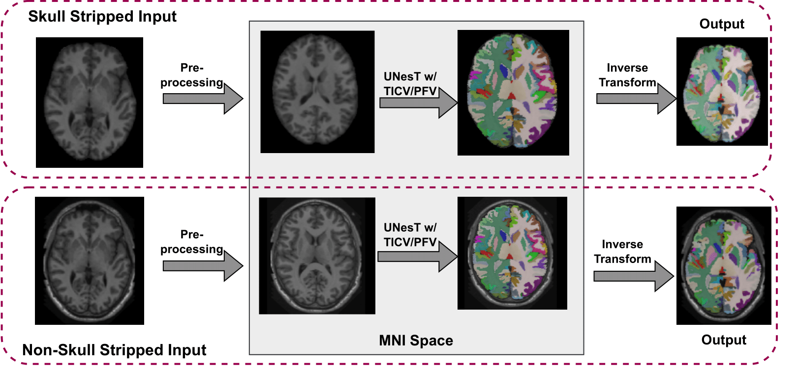

# Whole brain segmentation
---
132 brain regions and TICV/PFV segmentation. It has been implemented as a single Singularity.
<!-- <p align="center">

</p>

<p align="center">

</p> -->
```diff
+ Please cite the following MedIA/SPIE paper, if you used the UNesT whole brain segmentation.
```
```
@article{yu2023unest,
  title={UNesT: local spatial representation learning with hierarchical transformer for efficient medical segmentation},
  author={Yu, Xin and Yang, Qi and Zhou, Yinchi and Cai, Leon Y and Gao, Riqiang and Lee, Ho Hin and Li, Thomas and Bao, Shunxing and Xu, Zhoubing and Lasko, Thomas A and others},
  journal={Medical Image Analysis},
  pages={102939},
  year={2023},
  publisher={Elsevier}
}

@misc{yu2023enhancing,
      title={Enhancing Hierarchical Transformers for Whole Brain Segmentation with Intracranial Measurements Integration}, 
      author={Xin Yu and Yucheng Tang and Qi Yang and Ho Hin Lee and Shunxing Bao and Yuankai Huo and Bennett A. Landman},
      year={2023},
      eprint={2309.04071},
      archivePrefix={arXiv},
      primaryClass={eess.IV}
}
```

## Singularity
<p align="center">

</p>

Pre-built container can be downloaded [here](https://vanderbilt.box.com/s/glnq14bvbmx8a9lpklzoe7olgdcwkqp9).
### Command to run Singularity

    singularity run -e --contain 
    --home /path/to/inputs/directory/ \
    -B /path/to/inputs/directory/:/INPUTS \
    -B /path/to/working/directory/:/WORKING_DIR \
    -B /path/to/output/directory/:/OUTPUTS \
    -B /tmp:/tmp \
    --nv \
    /path/to/wholebrain.sif \
    [--ticv --w_skull --overlap 0.5 --device 1]

* `--nv` only required when using GPU. 
* Use `--device` to specify the GPU device. Default is 0.
* When working with non-skull stripped data, ensure to include the `--w_skull` option. If the option is omitted, the input will be assumed to be skull stripped data
* To enable TICV/PFV estimation, include the `--ticv` option. Omitting this option will result in an output containing only the segmentation of 132 brain regions.
* `--overlap` represents the overlap rate in MONAI sliding window inference. Default is 0.7.

## Prepare Training Data
---
We convert the training data list into json file using [create_json.py](utils/create_json.py).

The training and validation data are saved as follow:

    train/
        ├── images
        ├── labels
    validation/    
        ├── images
        ├── labels

## Training
---
We specifiy the model hyperparmeters in the yaml files, sample yaml files for different model scales can be found in [yaml](yaml) folder. 

    yaml/
        ├── unest_base
        ├── unest_large
        ├── unest_small
        ├── unest_ticv

Before training, specify the paths in the yaml files and set the yaml path in the [main.py](main.py). For UNesT with TICV/PFV estimation, use [main_ticv.py](main_ticv.py)

## Inference
---
We use [inference.py](inference.py) to test each images in the testing set and save the probability of each fold into .npy format for further ensemble. We use [ensemble.py](ensemble.py) to ensemble the predictions from different folds and save the final prediction into Nifti format. The trained model weight can found here: [wholebrainseg_weight](https://drive.google.com/file/d/14kj0QIHi_MsWf4B1sfmJLGDM1ZAdX9Od/view?usp=share_link).

The results of different folds is saved as below:

    pred_0.7/
        ├── fold0
        ├── fold1
        ├── fold2
        ├── fold3
        ├── fold4

Running inference:
```
python inference.py --imagesTs_path test_images_path --saved_model_path path2saved_model --base_dir output_path --fold 0 --overlap 0.7 --device 0
```

Running ensemble:
```
python ensemble.py --prob_dir output_from_inference --img_path test_images_path --out_path output_path
```


For UNesT with TICV/PFV estimation, we use [inference_ticv.py](inference_ticv.py) to test and save the final output into Nifti format. The trained model weight from whole brain segmentation with TICV/PFV estimation can found here: [wholebrainseg_ticv_weight](https://drive.google.com/file/d/1vomR2FlqDVq-C0iGvlBNHAqWg0jB8d9P/view?usp=sharing).

Running inference:
```
python inference_ticv.py --imagesTs_path test_images_path --saved_model_path path2saved_model --fold 0 --overlap 0.7 --device 0 --results_folder_brain output_path4wholebrain --results_folder_ticv output_path4ticv --results_folder_pfv output_path4pfv
```
## Convert from MNI space to original space
---
We convert the images in MNI space back to original space using [call_Run_Deep_brain.sh](mni2orig/call_Run_Deep_brain.sh). The script is based on [SLANTbrainSeg](https://github.com/MASILab/SLANTbrainSeg/tree/master). This script require Matlab, [Advanced Normalization Tools (Ants)](https://github.com/ANTsX/ANTs), and [NiftyReg](http://cmictig.cs.ucl.ac.uk/wiki/index.php/NiftyReg).

## MONAI Boundle
---
For developing publicly available segmentation tools, we introduce the MONAI Bundle module that supports building Python-based workflows via structured configurations[Whole Brain Segmentation MONAI Boundle](https://github.com/Project-MONAI/model-zoo/tree/dev/models/wholeBrainSeg_Large_UNEST_segmentation).

## Complete ROI of the whole brain segmentation
---
133 brain structures are segmented.

| #1 | #2 | #3 | #4 |
| :------------ | :---------- | :-------- |  :-------- |
| 0:  background  |  1 :  3rd-Ventricle  | 2 :  4th-Ventricle  |  3 :  Right-Accumbens-Area  |
|  4 :  Left-Accumbens-Area  |  5 :  Right-Amygdala  |  6 :  Left-Amygdala  |  7 :  Brain-Stem  |
|  8 :  Right-Caudate  |  9 :  Left-Caudate  |  10 :  Right-Cerebellum-Exterior  |  11 :  Left-Cerebellum-Exterior  |
|  12 :  Right-Cerebellum-White-Matter  |  13 :  Left-Cerebellum-White-Matter  |  14 :  Right-Cerebral-White-Matter  | 15 :  Left-Cerebral-White-Matter  |
|  16 :  Right-Hippocampus  |  17 :  Left-Hippocampus  |  18 :  Right-Inf-Lat-Vent  |  19 :  Left-Inf-Lat-Vent  |
|  20 :  Right-Lateral-Ventricle  |  21 :  Left-Lateral-Ventricle  |  22 :  Right-Pallidum  |  23 :  Left-Pallidum  |
|  24 :  Right-Putamen  |  25 :  Left-Putamen  | 26 :  Right-Thalamus-Proper  |  27 :  Left-Thalamus-Proper  |
|  28 :  Right-Ventral-DC  |  29 :  Left-Ventral-DC  |  30 :  Cerebellar-Vermal-Lobules-I-V  |  31 :  Cerebellar-Vermal-Lobules-VI-VII  |
|  32 :  Cerebellar-Vermal-Lobules-VIII-X  |  33 :  Left-Basal-Forebrain  |  34 :  Right-Basal-Forebrain  |  35 :  Right-ACgG--anterior-cingulate-gyrus  |
|  36 :  Left-ACgG--anterior-cingulate-gyrus  |  37 :  Right-AIns--anterior-insula  |  38 :  Left-AIns--anterior-insula  | 39 :  Right-AOrG--anterior-orbital-gyrus |
| 40 :  Left-AOrG--anterior-orbital-gyrus  |  41 :  Right-AnG---angular-gyrus  |  42 :  Left-AnG---angular-gyrus  |  43 :  Right-Calc--calcarine-cortex  |
|  44 :  Left-Calc--calcarine-cortex  |  45 :  Right-CO----central-operculum  |  46 :  Left-CO----central-operculum  |  47 :  Right-Cun---cuneus  |
|  48 :  Left-Cun---cuneus  |  49 :  Right-Ent---entorhinal-area  |  50 :  Left-Ent---entorhinal-area  |  51 :  Right-FO----frontal-operculum  |
|  52 :  Left-FO----frontal-operculum  |  53 :  Right-FRP---frontal-pole  |  54 :  Left-FRP---frontal-pole  |  55 :  Right-FuG---fusiform-gyrus   |
|  56 :  Left-FuG---fusiform-gyrus  |  57 :  Right-GRe---gyrus-rectus  |  58 :  Left-GRe---gyrus-rectus  |  59 :  Right-IOG---inferior-occipital-gyrus
|  60 :  Left-IOG---inferior-occipital-gyrus  |  61 :  Right-ITG---inferior-temporal-gyrus  |  62 :  Left-ITG---inferior-temporal-gyrus  | 63 :  Right-LiG---lingual-gyrus  |
|  64 :  Left-LiG---lingual-gyrus  |  65 :  Right-LOrG--lateral-orbital-gyrus  |  66 :  Left-LOrG--lateral-orbital-gyrus  |  67 :  Right-MCgG--middle-cingulate-gyrus  |
|  68 :  Left-MCgG--middle-cingulate-gyrus  |  69 :  Right-MFC---medial-frontal-cortex  |  70 :  Left-MFC---medial-frontal-cortex  |  71 :  Right-MFG---middle-frontal-gyrus  |
|  72 :  Left-MFG---middle-frontal-gyrus  |  73 :  Right-MOG---middle-occipital-gyrus  |  74 :  Left-MOG---middle-occipital-gyrus  |  75 :  Right-MOrG--medial-orbital-gyrus  |
|  76 :  Left-MOrG--medial-orbital-gyrus  |  77 :  Right-MPoG--postcentral-gyrus  |  78 :  Left-MPoG--postcentral-gyrus  |  79 :  Right-MPrG--precentral-gyrus  |
|  80 :  Left-MPrG--precentral-gyrus  |  81 :  Right-MSFG--superior-frontal-gyrus  |  82 :  Left-MSFG--superior-frontal-gyrus  |  83 :  Right-MTG---middle-temporal-gyrus  |
|  84 :  Left-MTG---middle-temporal-gyrus  |  85 :  Right-OCP---occipital-pole  |  86 :  Left-OCP---occipital-pole  |  87 :  Right-OFuG--occipital-fusiform-gyrus  |
|  88 :  Left-OFuG--occipital-fusiform-gyrus  |  89 :  Right-OpIFG-opercular-part-of-the-IFG  |  90 :  Left-OpIFG-opercular-part-of-the-IFG  |  91 :  Right-OrIFG-orbital-part-of-the-IFG  |
|  92 :  Left-OrIFG-orbital-part-of-the-IFG  |  93 :  Right-PCgG--posterior-cingulate-gyrus  |  94 :  Left-PCgG--posterior-cingulate-gyrus  |  95 :  Right-PCu---precuneus  |
|  96 :  Left-PCu---precuneus  |  97 :  Right-PHG---parahippocampal-gyrus  |  98 :  Left-PHG---parahippocampal-gyrus  |  99 :  Right-PIns--posterior-insula  |
|  100 :  Left-PIns--posterior-insula  |  101 :  Right-PO----parietal-operculum  |  102 :  Left-PO----parietal-operculum  |  103 :  Right-PoG---postcentral-gyrus  |
|  104 :  Left-PoG---postcentral-gyrus  |  105 :  Right-POrG--posterior-orbital-gyrus  |  106 :  Left-POrG--posterior-orbital-gyrus  |  107 :  Right-PP----planum-polare  |
|  108 :  Left-PP----planum-polare  |  109 :  Right-PrG---precentral-gyrus  |  110 :  Left-PrG---precentral-gyrus  |  111 :  Right-PT----planum-temporale  |
|  112 :  Left-PT----planum-temporale  |  113 :  Right-SCA---subcallosal-area  |  114 :  Left-SCA---subcallosal-area  |  115 :  Right-SFG---superior-frontal-gyrus  |
|  116 :  Left-SFG---superior-frontal-gyrus  |  117 :  Right-SMC---supplementary-motor-cortex  |  118 :  Left-SMC---supplementary-motor-cortex  |  119 :  Right-SMG---supramarginal-gyrus  |
|  120 :  Left-SMG---supramarginal-gyrus  |  121 :  Right-SOG---superior-occipital-gyrus  |  122 :  Left-SOG---superior-occipital-gyrus  |  123 :  Right-SPL---superior-parietal-lobule  |
|  124 :  Left-SPL---superior-parietal-lobule  |  125 :  Right-STG---superior-temporal-gyrus  |  126 :  Left-STG---superior-temporal-gyrus  |  127 :  Right-TMP---temporal-pole  |
|  128 :  Left-TMP---temporal-pole  |  129 :  Right-TrIFG-triangular-part-of-the-IFG  |  130 :  Left-TrIFG-triangular-part-of-the-IFG  |  131 :  Right-TTG---transverse-temporal-gyrus  |
|  132 :  Left-TTG---transverse-temporal-gyrus  |
---

## Acknowledgement
We leveraged certain aspects from [yuankaihuo/SLANTbrainSeg](https://github.com/MASILab/SLANTbrainSeg/tree/master) and [MASILab/PreQual](https://github.com/MASILab/PreQual).